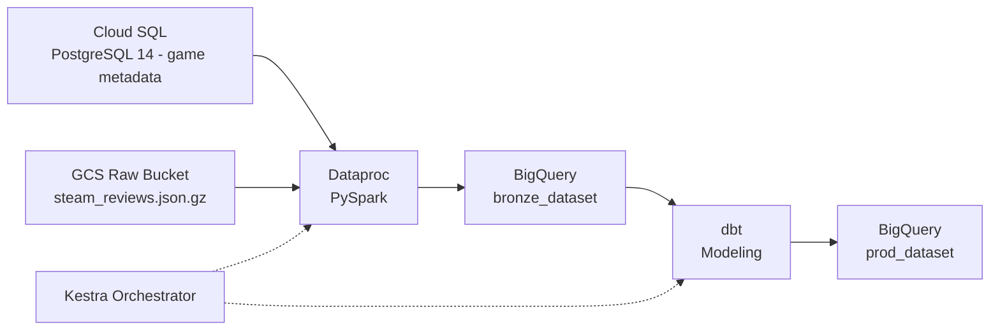

# Steam Review Analytics Pipeline

Steam review data ships as messy, semi-structured JSON blobs with no analytical schema, making basic questions like "how does review sentiment vary by genre" impossible to answer without a proper warehouse. This pipeline pulls relational game metadata from Cloud SQL and ~1.3GB of nested review data from GCS, cleans and flattens both with PySpark on Dataproc, and models the result into a BigQuery star schema via dbt, with Kestra orchestrating the whole run end to end.

## Architecture & Data Flow



Everything is inside GCP once provisioned, so Dataproc clusters (orchestrated by Kestra) pull raw review JSON from the GCS bucket and turns them into Spark RDDs. This is so Spark can handle schema normalisation, flattening, and stage cleaned records into BigQuery bronze tables alongside game metadata ingested from Cloud SQL. dbt then handles dimensional modelling within BigQuery. All transformations are strictly in-warehouse. Kestra acts as a dedicated control plane which manages Dataproc lifecycles, job submissions and dbt execution via API calls.

## Pipeline Performance & Scale

| Metric | Value |
|---|---|
| Raw dataset size | ~1.3 GB (`steam_reviews.json.gz`) |
| Raw review records | 7.79M |
| Clean records loaded (`fct_reviews`) | 6.87M |
| Games loaded (`dim_games`) | 32K |
| Unique users loaded (`dim_users`) | 2.56M |
| Dataproc job runtime | ~1 min (single `e2-standard-4` node) |
| Total flow runtime (Dataproc + BigQuery + dbt) | 6m 04s |
| Compute cost per full run | < $0.05 |

## Engineering Challenges & Workarounds

**Parsing Professor McAuley's Steam dataset.** The raw files themselves are not valid JSON. Instead, they are formatted as Python 2 `repr()` output. This is characterised by single-quoted, stringified dicts with the occasional embedded byte string, and prefixed `u` to indicate the text is Unicode. The standard `json.loads` and BigQuery's JSON loader cannot parse this. To fix this, I mapped each line using `ast.literal_eval` inside of a Spark RDD. This was wrapped in a `try/except` block so that malformed records are dropped and don't crash the job. Roughly 900K of the 7.79M raw rows aren't in `fct_reviews` because they were either empty review texts, duplicates, or they failed `literal_eval` parsing.

**Single-node Dataproc, on purpose.** The cluster is made of a single `e2-standard-4` node, ephemerally created to complete the Spark job and then immediately destroyed. I used only a single node for the cluster because at this data volume (a few GB), the co-ordination of a multi-node cluster costs more in shuffle and network time than it saves. A single node for this job kept runtime and costs down. At under $0.05 compute per run, this is simple and cheap. If the data volume were to scale though, multi-node clusters would be more appropriate.

**JDBC driver resolves.** Originally, the `org.postgresql:postgresql:42.7.3` .jar file was uploaded to GCS manually. However, I found it better to pull the file from the Maven repository using its coordinates. I did this because it means that there is no permanent .jar file in the GCS storage bucket as overhead. This does come at the trade-off that there is an extra 5-10 second latency in the Spark job from pulling this file, but because it also makes for a more seamless IaC experience, I believe that this cost is worth it. 

**Kestra OSS has no secrets UI.** Kestra doesn't contain a secrets manager in the web UI, this means that there is no clean place to store a GCP service account key without placing it in plaintext in the flow YAML. To fix this, using `main.tf` I generated a `.env` file which contains the service account key. I did this to pass it as an environment variable in Docker Compose, which is read by Kestra. This approach isn't scalable safely in environments where other users can inspect container environment variables (e.g. an enterprise environment), this is the cost of not using Kestra Enterprise Edition.

**In-warehouse dimensional modelling and test gating.** `fct_reviews` joins staged review records with game metadata and user dimensions into a star schema. To verify that transformations are executed correctly, `dbt build` executes models and data tests in dependency order within Kestra. If the tests fail (e.g. `hours >= 0`, or surrogate keys are null), modelling halts before corrupt records can be queried in production datasets during analysis. Python formatting and syntax are enforced using GitHub Actions CI via Ruff before the code reaches Kestra.

## Data Warehouse Schema

| Table | Type | Grain | Materialisation |
|---|---|---|---|
| `fct_reviews` | Fact | One row per review (metrics, engagement, votes) | Table (full refresh in dbt build) |
| `dim_games` | Dimension | One row per game (developer, publisher, genre, pricing) | Table |
| `dim_users` | Dimension | One row per reviewing user | Table |

`fct_reviews` joins to `dim_games` and `dim_users` on their respective surrogate keys. Staging tables produced by the Dataproc job land in `bronze_dataset`; dbt reads from there and writes the modeled star schema to `prod_dataset`.

## Set-up

```bash
git clone https://github.com/matthewchdu/steam-data-pipeline.git
cd steam-data-pipeline

pip install google-cloud-storage psycopg2-binary requests

# Download steam_games.json.gz and steam_reviews.json.gz from the
# UCSD McAuley Lab Steam dataset and place into raw/
# https://cseweb.ucsd.edu/~jmcauley/datasets.html
mkdir -p raw

# Set Up and Apply Terraform
cd terraform
terraform init
terraform apply
cd ..

# Create Docker Container
docker compose up -d

# Seeds Cloud SQL Database
python source_system/seed_metadata.py

# Configures all variables, and uploads flow to Kestra
python setup_pipeline.py

# open http://localhost:8080 and trigger steam_data_pipeline

# results land in <project_id>.prod_dataset:
# fct_reviews / dim_games / dim_users

cd terraform
terraform destroy
```
