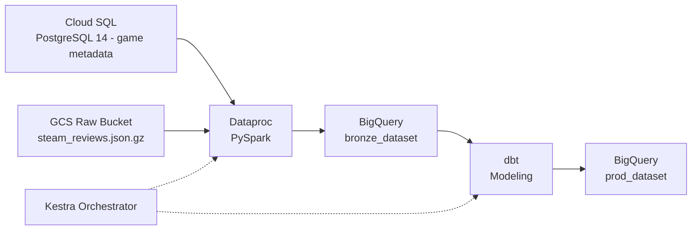

# Steam Review Analytics Pipeline

## System Overview

This pipeline ingests relational Steam game metadata and unstructured, deeply nested Steam review data, normalizes both through a distributed compute layer, and models the result into a BigQuery star schema for analytical querying. Infrastructure provisioning, batch compute, warehouse transformation, and orchestration are each isolated as independently deployable, ephemeral components.

## Architecture Diagram



## Prerequisites

Before you begin, make sure you have:

- A GCP project with billing enabled, and the `gcloud` CLI authenticated (`gcloud auth application-default login`)
- [Terraform](https://developer.hashicorp.com/terraform/install) installed locally
- [Docker](https://docs.docker.com/get-docker/) and Docker Compose (used to run Kestra OSS)
- Python 3.10+, with the following packages installed for the local setup scripts:

  ```bash
  pip install google-cloud-storage psycopg2-binary requests
  ```

- **The raw dataset is not included in this repository and must be downloaded manually.** Download `steam_reviews.json.gz` (~1.3 GB) and `steam_games.json.gz` from the [UCSD Steam Review dataset (McAuley Lab)](https://cseweb.ucsd.edu/~jmcauley/datasets.html#steam_data) and place both files in the `raw/` directory before running setup:

  ```
  raw/
  ├── steam_games.json.gz
  └── steam_reviews.json.gz
  ```

## Component Specifications & Decisions

### 1. Infrastructure as Code (Terraform)

**Implementation**
- Provisions a Cloud SQL PostgreSQL 14 instance, a GCS bucket with a 30-day lifecycle policy for automatic deletion of temporary raw data, two BigQuery datasets (`bronze_dataset` for staging and `prod_dataset` for the modeled star schema), and a dedicated least-privilege IAM service account.
- On `apply`, Terraform writes two files to the repository root: `SERVICE_ACC_KEY.json` (the service account key) and `config.json` (the dynamic Cloud SQL public IP, bucket name, and project ID). Both are git-ignored and consumed by the setup scripts below.

**Configuration**
- Copy the example variables file and fill in your own project ID and region:

  ```bash
  cp terraform/terraform.tfvars.example terraform/terraform.tfvars
  ```

- **Keep `region = "us-central1"`.** The Dataproc batch job is invoked against `us-central1` in the orchestration flow; deploying other resources in a different region will introduce cross-region egress latency (and cost) between Cloud SQL, GCS, and Dataproc.

**Design Rationale**
- Declarative resource management ensures reproducible environments across deployments.
- `terraform destroy` enables full, automated teardown, eliminating idle cloud compute costs between runs.

### 2. Source Ingestion & Storage

**Implementation**
- Relational game metadata (`steam_games.json.gz`) is loaded into Cloud SQL for PostgreSQL.
- Unstructured review data (`steam_reviews.json.gz`, ~1.3 GB nested JSON) is uploaded to the GCS raw bucket by `setup_pipeline.py`.

**Design Rationale**
- Hosting PostgreSQL within GCP (Cloud SQL) rather than locally in Docker keeps the entire network topology inside the cloud provider.
- This eliminates VPN/tunneling latency and external network ingress bottlenecks during distributed compute jobs.

### 3. Heavy Compute Layer (PySpark on Dataproc)

**Implementation**
- An ephemeral, single-node Dataproc cluster (`e2-standard-4`) is created on demand by the orchestration flow, ingests raw nested JSON from GCS, and pulls relational metadata from Cloud SQL via JDBC.
- The job flattens nested structures, casts types, handles malformed timestamps, and writes partitioned staging tables to `bronze_dataset` in BigQuery.
- The Postgres JDBC driver is **not** vendored as a `.jar` in this repository or in GCS — it's resolved dynamically at job submission time via its Maven coordinate (`org.postgresql:postgresql:42.7.3`).
- The cluster is explicitly torn down by the flow on both success and failure, so no compute is left running between runs.

**Design Rationale**
- Distributed Spark compute is decoupled from the warehouse to absorb compute-heavy JSON array exploding and schema normalization before loading.
- This avoids expensive BigQuery slot contention and un-optimized warehouse queries.

### 4. Analytics Modeling & Quality (dbt + BigQuery)

**Implementation**
- Transforms `bronze_dataset` staging data into a star schema in `prod_dataset`: `fct_reviews` (review metrics, engagement, votes; partitioned by date, materialized incrementally) plus `dim_games` (developer, publisher, genre, pricing) and `dim_users`.
- Enforces automated constraints via `schema.yaml`, including unique keys, not-null constraints, and range assertions (e.g. `playtime_forever >= 0`).

**Design Rationale**
- Incremental materialization avoids full table scans on historical reviews.
- In-warehouse SQL modeling separates extract/load transformations from business logic.

### 5. Orchestration (Kestra OSS)

**Implementation**
- Kestra runs locally via Docker Compose and executes an end-to-end DAG: detects new objects in GCS, provisions the ephemeral Dataproc cluster described above, submits the PySpark job, runs `dbt run` and `dbt test`, tears the cluster down, and logs execution status.
- **Secret handling:** because Kestra OSS has no web-UI secrets manager, GCP credentials are passed into the container via environment configuration rather than the UI. Populate a `SECRET_GCP_CREDS` entry in your `.env` file with the raw JSON contents of `SERVICE_ACC_KEY.json`:

  ```bash
  # .env
  SECRET_GCP_CREDS='<paste the full contents of SERVICE_ACC_KEY.json here>'
  ```

- If you fork this repository, update the `clone_repository` task URL inside the flow YAML (`flows/dev.steam_data_pipeline.yaml`) to point at your fork — otherwise Kestra will pull the upstream repo's flow definition instead of your own.

**Design Rationale**
- Provides declarative, code-defined orchestration with deterministic state management.
- Delivers automated retry and failure alerting across disparate GCP services.

### 6. Continuous Integration (GitHub Actions)

**Implementation**
- Triggers automatically on pull requests to run Python linting/formatting (`ruff`) on scripts and syntax compilation checks (`dbt compile`) on warehouse models.

**Design Rationale**
- Enforces code quality and catches SQL/pipeline syntax errors prior to merging to production branches.

## Data Schema

| Table | Type | Grain | Partitioning |
|---|---|---|---|
| `fct_reviews` | Fact | One row per review (metrics, engagement, votes) | Partitioned by review date; incremental materialization |
| `dim_games` | Dimension | One row per game (developer, publisher, genre, pricing) | Not partitioned |
| `dim_users` | Dimension | One row per reviewing user | Not partitioned |

`fct_reviews` joins to `dim_games` and `dim_users` on their respective surrogate keys, forming a standard star schema over `prod_dataset`. Staging tables produced by the Dataproc job land in `bronze_dataset`.

## Quickstart: Clone to Teardown

```bash
# 1. Clone the repository
git clone <your-fork-or-repo-url>
cd steam-data-pipeline

# 2. Download the raw dataset manually into raw/
#    (steam_games.json.gz and steam_reviews.json.gz — see Prerequisites above)

# 3. Install local Python dependencies
pip install google-cloud-storage psycopg2-binary requests

# 4. Configure and provision infrastructure
cp terraform/terraform.tfvars.example terraform/terraform.tfvars
# edit terraform.tfvars with your GCP project ID (keep region = "us-central1")
cd terraform
terraform init
terraform apply
cd ..
# this writes SERVICE_ACC_KEY.json and config.json to the repo root

# 5. Seed Cloud SQL with game metadata
python source_system/seed_metadata.py

# 6. Upload raw reviews to GCS, inject runtime IDs into the flow YAML,
#    and register the flow with Kestra via its REST API
python setup_pipeline.py

# 7. Start Kestra OSS
#    First, create a .env file with SECRET_GCP_CREDS set to the contents
#    of SERVICE_ACC_KEY.json (see Orchestration section above), then:
docker compose up -d

# 8. Trigger the flow
#    Open the Kestra UI (default: http://localhost:8080) and execute
#    dev.steam_data_pipeline, or trigger it via the REST API.
#    The flow will provision Dataproc, run the PySpark job, load
#    bronze_dataset, run dbt, and tear the Dataproc cluster down.

# 9. Inspect the results in BigQuery
#    fct_reviews / dim_games / dim_users live in <project_id>.prod_dataset

# 10. Tear down all cloud infrastructure when finished
cd terraform
terraform destroy
```

### Implementation Status
- [x] Infrastructure provisioning (Terraform)
- [x] Cloud storage & Cloud SQL ingestion
- [x] PySpark transformation on Dataproc
- [x] dbt modeling & automated testing
- [x] End-to-end Kestra orchestration
