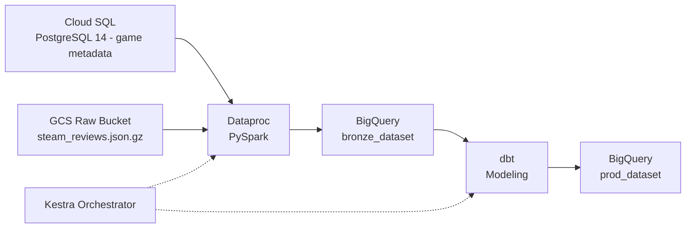

# Steam Review Analytics Pipeline

Steam review data ships as messy, semi-structured JSON blobs with no analytical schema, making basic questions like "how does review sentiment vary by genre" impossible to answer without a proper warehouse. This pipeline pulls relational game metadata from Cloud SQL and ~1.3GB of nested review data from GCS, cleans and flattens both with PySpark on Dataproc, and models the result into a BigQuery star schema via dbt, with Kestra orchestrating the whole run end to end.

## Architecture & Data Flow



Everything lives inside GCP once provisioned, so Dataproc reads game metadata over an internal JDBC connection to Cloud SQL instead of tunneling out to a local Postgres instance, which removes a real bottleneck when a single Spark job is doing 7.8M row-level lookups. Raw review JSON sits in GCS until Dataproc pulls it directly into RDDs, flattens and casts it, and writes partitioned staging tables into `bronze_dataset`. dbt then reads and writes entirely within BigQuery, so the transformation layer never leaves the warehouse. Kestra sits outside the data path entirely, only holding to it via API calls to spin Dataproc up, submit the job, trigger dbt, and tear the cluster down.

## Pipeline Performance & Scale

| Metric | Value |
|---|---|
| Raw dataset size | ~1.3 GB (`steam_reviews.json.gz`) |
| Raw review records | 7.79M |
| Clean records loaded (`fct_reviews`) | 6.87M |
| Games loaded (`dim_games`) | 32K |
| Unique users loaded (`dim_users`) | 2.56M |
| Dataproc job runtime | ~6 min (single `e2-standard-4` node) |
| Total flow runtime (Dataproc + BigQuery + dbt) | 6m 04s |
| Compute cost per full run | < $0.05 |

## Engineering Challenges & Workarounds

**Parsing the McAuley dataset.** The raw review file isn't valid JSON — it's Python 2 `repr()` output, single-quoted stringified dicts with the occasional embedded byte string. Both BigQuery's native JSON loader and standard `json.loads` choke on it immediately. The fix was mapping each line through `ast.literal_eval` inside the Spark RDD instead of `json.loads`, wrapped in a try/except so a single malformed record gets dropped and logged rather than killing the whole distributed job. Roughly 900K of the 7.79M raw rows never made it to `fct_reviews` — most of it duplicate reviews and a smaller set of records that failed `literal_eval` outright.

**Single-node Dataproc, on purpose.** The cluster is one `e2-standard-4` node, created right before the job submits and torn down the moment it finishes — no standing cluster, no multi-node shuffle. At this data volume (a few GB post-flatten), the coordination overhead of a multi-node cluster costs more in shuffle and network time than it saves in parallelism, so single-node keeps both runtime and cost down. The tradeoff is real: this doesn't scale past a few times the current volume without re-architecting, but for a bounded, on-demand batch job it's the cheaper and simpler option, at under $0.05 compute per run.

**JDBC driver, resolved not vendored.** The Postgres JDBC driver (`org.postgresql:postgresql:42.7.3`) isn't checked into the repo or staged in GCS as a `.jar`. It's pulled by its Maven coordinate at job submission time, which keeps the repo free of binary artifacts and means driver version bumps are a one-line change instead of a re-upload.

**Kestra OSS has no secrets UI.** Kestra OSS doesn't ship a secrets manager in its web UI, so there's no clean place to store a GCP service account key without it ending up in a flow YAML in plaintext. The workaround is passing the raw JSON contents of the service account key into Docker Compose as an environment variable (`SECRET_GCP_CREDS`), read by Kestra at container start. It's a real gap in the OSS tier — the Enterprise edition has a proper secrets backend — and this approach only holds up because the `.env` file is git-ignored and the box running Compose isn't multi-tenant.

**Incremental modeling in dbt.** `fct_reviews` is partitioned by review date and materialized incrementally rather than as a full rebuild, since re-scanning 6.87M historical rows on every run wastes slots for no reason once the table is past its first load. The incremental logic filters `bronze_dataset` staging rows to just the max partition already loaded, so each run only processes what Dataproc wrote in that batch. Range and not-null tests (`playtime_forever >= 0`, non-null surrogate keys) run as part of `dbt test` in CI, not just at run time, so a bad upstream batch fails the PR before it touches `prod_dataset`.

## Data Warehouse Schema

| Table | Type | Grain | Partitioning |
|---|---|---|---|
| `fct_reviews` | Fact | One row per review (metrics, engagement, votes) | Partitioned by review date; incremental materialization |
| `dim_games` | Dimension | One row per game (developer, publisher, genre, pricing) | Not partitioned |
| `dim_users` | Dimension | One row per reviewing user | Not partitioned |

`fct_reviews` joins to `dim_games` and `dim_users` on their respective surrogate keys. Staging tables produced by the Dataproc job land in `bronze_dataset`; dbt reads from there and writes the modeled star schema to `prod_dataset`.

## Quickstart

```bash
git clone <your-fork-or-repo-url>
cd steam-data-pipeline

# download steam_games.json.gz and steam_reviews.json.gz from the
# UCSD McAuley Lab Steam dataset into raw/
mkdir -p raw

pip install google-cloud-storage psycopg2-binary requests

cp terraform/terraform.tfvars.example terraform/terraform.tfvars
# set your GCP project ID in terraform.tfvars — keep region = "us-central1",
# the Dataproc job is hardcoded to run there

cd terraform
terraform init
terraform apply
cd ..
# writes SERVICE_ACC_KEY.json and config.json to the repo root

python source_system/seed_metadata.py
python setup_pipeline.py

# create .env with:
# SECRET_GCP_CREDS='<contents of SERVICE_ACC_KEY.json>'
docker compose up -d

# open http://localhost:8080 and trigger dev.steam_data_pipeline,
# or fire it via the Kestra REST API

# results land in <project_id>.prod_dataset:
# fct_reviews / dim_games / dim_users

cd terraform
terraform destroy
```
