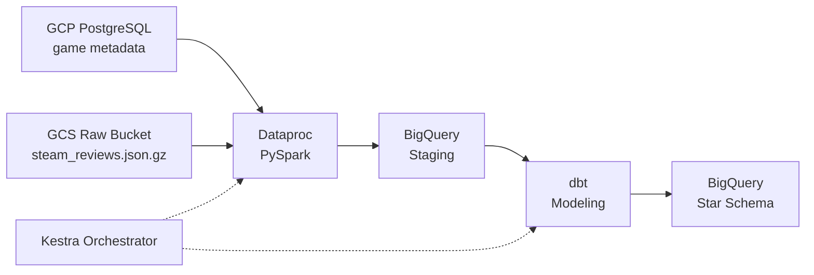

# Steam Review Analytics Pipeline

## System Overview

This pipeline ingests relational Steam game metadata and unstructured, deeply nested Steam review data, normalizes both through a distributed compute layer, and models the result into a BigQuery star schema for analytical querying. Infrastructure provisioning, batch compute, warehouse transformation, and orchestration are each isolated as independently deployable, ephemeral components.

## Architecture Diagram

## Component Specifications & Decisions

### 1. Infrastructure as Code (Terraform)

**Implementation**
- Provisions a GCS bucket with a 30-day lifecycle policy for automatic deletion of temporary raw data.
- Provisions BigQuery datasets (`steam_staging`, `steam_analytics`), a GCP-hosted PostgreSQL instance, and dedicated least-privilege IAM service accounts.

**Design Rationale**
- Declarative resource management ensures reproducible environments across deployments.
- `terraform destroy` enables full, automated teardown, eliminating idle cloud compute costs between runs.

### 2. Source Ingestion & Storage

**Implementation**
- Relational game metadata (`steam_games.json.gz`) is loaded into GCP-hosted PostgreSQL.
- Unstructured review data (`steam_reviews.json.gz`, ~1.3 GB nested JSON) is stored directly in the GCS raw bucket.

**Design Rationale**
- Hosting PostgreSQL within GCP rather than locally in Docker keeps the entire network topology inside the cloud provider.
- This eliminates VPN/tunneling latency and external network ingress bottlenecks during distributed compute jobs.

### 3. Heavy Compute Layer (PySpark on Dataproc)

**Implementation**
- An ephemeral Dataproc batch job ingests raw nested JSON from GCS and pulls relational metadata from GCP PostgreSQL via JDBC.
- The job flattens nested structures, casts types, handles malformed timestamps, and writes partitioned staging tables to BigQuery.

**Design Rationale**
- Distributed Spark compute is decoupled from the warehouse to absorb compute-heavy JSON array exploding and schema normalization before loading.
- This avoids expensive BigQuery slot contention and un-optimized warehouse queries.

### 4. Analytics Modeling & Quality (dbt + BigQuery)

**Implementation**
- Transforms BigQuery staging data into a star schema: `fct_reviews` (review metrics, engagement, votes; partitioned by date, materialized incrementally) plus `dim_games` (developer, publisher, genre, pricing) and `dim_users`.
- Enforces automated constraints via `schema.yml`, including unique keys, not-null constraints, and range assertions (e.g. `playtime_forever >= 0`).

**Design Rationale**
- Incremental materialization avoids full table scans on historical reviews.
- In-warehouse SQL modeling separates extract/load transformations from business logic.

### 5. Orchestration (Kestra)

**Implementation**
- Executes an end-to-end DAG: detects new objects in GCS, triggers a Dataproc Serverless batch job, runs `dbt run` and `dbt test`, and logs execution status.

**Design Rationale**
- Provides declarative, code-defined orchestration with deterministic state management.
- Delivers automated retry and failure alerting across disparate GCP services.

### 6. Continuous Integration (GitHub Actions)

**Implementation**
- Triggers automatically on pull requests to run Python linting/formatting (`ruff`) on scripts and syntax compilation checks (`dbt compile`) on warehouse models.

**Design Rationale**
- Enforces code quality and catches SQL/pipeline syntax errors prior to merging to production branches.

## Data Schema

| Table | Type | Grain | Partitioning |
|---|---|---|---|
| `fct_reviews` | Fact | One row per review (metrics, engagement, votes) | Partitioned by review date; incremental materialization |
| `dim_games` | Dimension | One row per game (developer, publisher, genre, pricing) | Not partitioned |
| `dim_users` | Dimension | One row per reviewing user | Not partitioned |

`fct_reviews` joins to `dim_games` and `dim_users` on their respective surrogate keys, forming a standard star schema over `steam_analytics`.

### Implementation Status
- [x] Infrastructure provisioning (Terraform)
- [x] Cloud storage & Postgres ingestion
- [x] PySpark transformation on Dataproc
- [x] dbt modeling & automated testing
- [ ] End-to-end Kestra orchestration (Pending)
